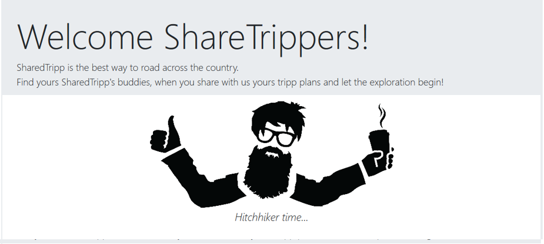

# Shared tripps app

(Course project) App for share travelling. User can offer trip or join the tripps of other users.

## Install

/Execute from project root directory/

Install project dependencies:
```
npm install
```
Start the app:
```
npx nodemon
```

Open in browser:
```
https://localhost:9999/home
```
## Basic dependencies
* Use Express.js as a back-end framework (^4.17.1)
* Use MongoDB as a database (^3.5.9)
* Use Mongoose for database modeling (^5.9.20)
* Use JWT to authenticate users (^8.5.1)
* Use Handlebars as view engine (^4.0.4)
